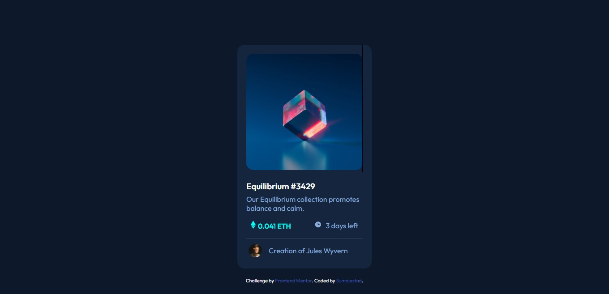

# Frontend Mentor - NFT preview card component solution

This is a solution to the [NFT preview card component challenge on Frontend Mentor](https://www.frontendmentor.io/challenges/nft-preview-card-component-SbdUL_w0U). Frontend Mentor challenges help you improve your coding skills by building realistic projects. 

## Table of contents

  - [The challenge](#the-challenge)
  - [Screenshot](#screenshot)
  - [Links](#links)
  - [Built with](#built-with)
  - [Author](#author)
  - [Acknowledgments](#acknowledgments)

### The challenge

Users should be able to:

- View the optimal layout depending on their device's screen size
- See hover states for interactive elements

### Screenshot

### Links

- Solution URL: [Add solution URL here](https://www.frontendmentor.io/solutions/nftpreviewcardcomponent-7XKJe-hxCR)
- Live Site URL: [Add live site URL here](https://cosmic-salmiakki-8717b0.netlify.app/)

### Built with

- Semantic HTML5 markup
- CSS custom properties
- Flexbox
- CSS Grid

## Acknowledgments

I want to give a special thanks to [@viniciusshenri96](https://www.frontendmentor.io/profile/viniciusshenri96) and [@vcarames](https://www.frontendmentor.io/profile/vcarames)for helping me and teaching me very useful things to improve my code

## Author

- Website - [Sumajestad44](https://github.com/sumajestad44)
- Frontend Mentor - [@sumajestad44](https://www.frontendmentor.io/profile/sumajestad44)

